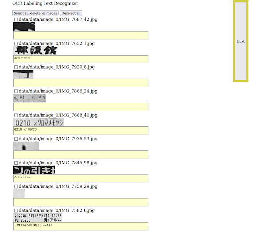

## OCR Text image annotation for japanese-ocr project training

## Web service start
``` Bash
cd ocr-label # Enter the ocr-label directory
python app.py 8080 #8080 port number, you can set any port
```


## 访问服务
http://127.0.0.1:8080/label      




## 参考
1. crnn  https://github.com/meijieru/crnn.pytorch.git              
2. chinese-ocr https://github.com/chineseocr/chineseocr
